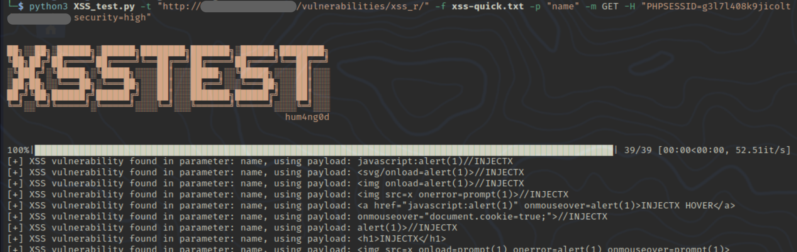

# XSS_Test

Testing for XSS vulnerability for specific parameter. You can use payload file of your own. 



`python3 -m pip install beautifulsoup4`

`python3 -m pip install tqdm`

### Usage:

```
-t: target URL
-p: parameter
-m: method
-H: cookie
-P: comma separated payloads
-f: payload file
```

### Examples:

```bash 
python3 xss_test.py -t "http://example-website.com/post.php" -p "name" -m GET -f xss-payload.txt 
```

```bash
python3 xss_test.py -t "http://example-website.com/post.php" -p "name" -m POST -H "COOKIES" -P "<script>alert(1)</script>,"
```

